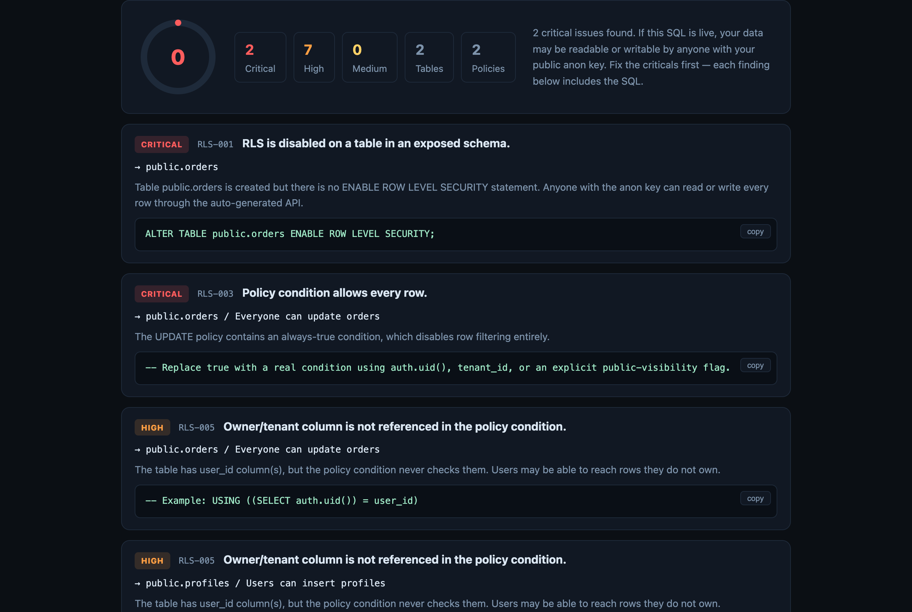

# 🛡 RLS Guard

**Free Supabase Row Level Security scanner — paste your migration SQL, get an instant audit with fix SQL.**

<p>
  <a href="https://rls-guard-rose.vercel.app"></a>
  
  
</p>

### ▶ Try it now: **[rls-guard-rose.vercel.app](https://rls-guard-rose.vercel.app)**

Paste your `supabase/migrations/*.sql` and get findings in milliseconds — no signup, no upload:



Most Supabase data leaks come from the same handful of misconfigurations: tables exposed without RLS, `USING (true)` policies, INSERT policies without `WITH CHECK`, roles that bypass RLS, and views that silently bypass RLS. RLS Guard reconstructs the final state of pasted migrations—including policy, grant, role, function, and view changes—and scans for 13 of these classes, with fix SQL for each finding.

## Why client-side matters

A security tool that uploads your schema is itself a security risk. RLS Guard runs **entirely in your browser** — your SQL is never uploaded, stored, or logged (verify in the network tab). It even flags service keys or connection strings accidentally pasted into SQL, without storing them.

## Rules

| Rule | Detects | Severity |
|---|---|---|
| RLS-001 | Table in exposed schema without RLS enabled | Critical |
| RLS-002 | RLS enabled but zero policies (silent lockout) | Medium |
| RLS-003 | Always-true policy conditions (`USING (true)`) | High/Critical |
| RLS-004 | INSERT policy missing `WITH CHECK` | High |
| RLS-005 | Owner/tenant column never referenced by any policy | High |
| RLS-006 | Write policies applied to PUBLIC role | High |
| RLS-007 | Policy omits every row condition (PostgreSQL defaults it to TRUE) | High/Critical |
| STORAGE-001 | Storage write policy is not constrained by `bucket_id` | High |
| GRANT-001 | Write privileges granted to `anon`/`public` | High |
| ROLE-001 | Database roles with `SUPERUSER` or `BYPASSRLS` | Critical |
| FUNC-001 | `SECURITY DEFINER` functions with unpinned search_path | High |
| VIEW-001 | Views without `security_invoker` (RLS bypass) | High |
| SECRET-001 | Service keys / connection strings inside SQL | Critical |

## Run locally

Any static server works:

```bash
npx serve .
```

Or use the engine directly in Node:

```js
import { scanSql } from './scanner.js';
const report = scanSql(mySql);
console.log(report.score, report.findings);
```

## Use in CI

Scan one migration, several ordered migrations, or stdin. The CLI exits with status 1 when it finds a Critical issue by default, so it can fail a CI job:

```bash
node cli.js supabase/migrations/*.sql
node cli.js --fail-on high supabase/migrations/*.sql
cat migration.sql | node cli.js --json
node cli.js --format markdown --output rls-guard-report.md supabase/migrations/*.sql
node cli.js --format sarif --output rls-guard.sarif supabase/migrations/*.sql
```

`--format` accepts `text`, `json`, `markdown`, or GitHub Code Scanning-compatible `sarif`. `--output` writes a review-ready artifact for pull requests and audit records. `--fail-on` accepts `critical`, `high`, `medium`, or `low`. Findings never include matched secret values.

Run the pinned public package without installing it globally:

```bash
npx @carjms/rls-guard@0.6.1 --fail-on high supabase/migrations/*.sql
```

## Limitations (honest ones)

Regex-based static analysis on a lightweight SQL splitter — it does not implement the full PostgreSQL grammar, distinguish overloaded functions that share a name, or test live access. It only reconstructs the ordered SQL supplied in one scan. **A clean scan is not a security guarantee.** Treat it as a fast first pass, not an audit.

Found a false positive or a rule idea? [Open an issue](../../issues) — feedback directly shapes the ruleset.

## Roadmap

- [x] CI-ready CLI with severity thresholds and JSON output
- [x] Migration state reconstruction for policy, grant, role, function, and view changes
- [x] Storage object write-policy bucket checks
- [x] SARIF output for GitHub Code Scanning

If any of these would be useful to you, a ⭐ and an issue telling me which one helps prioritize.

## License

MIT
